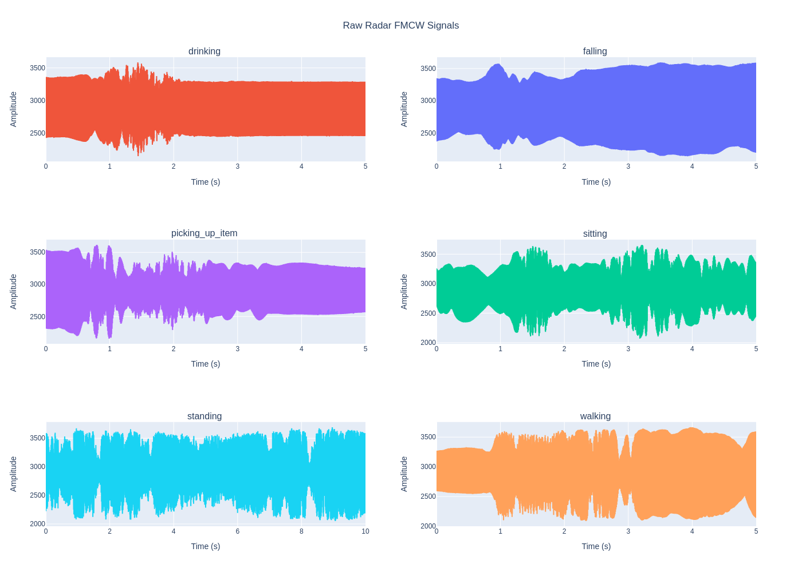
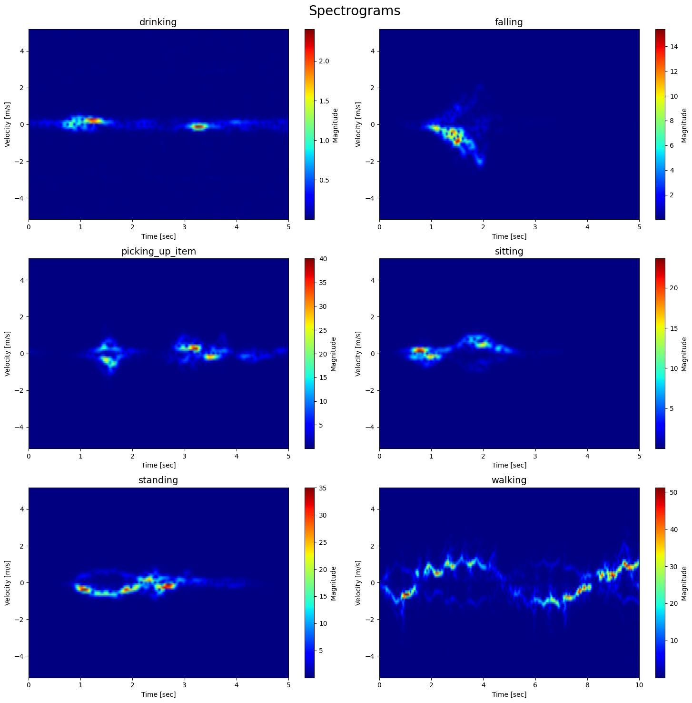
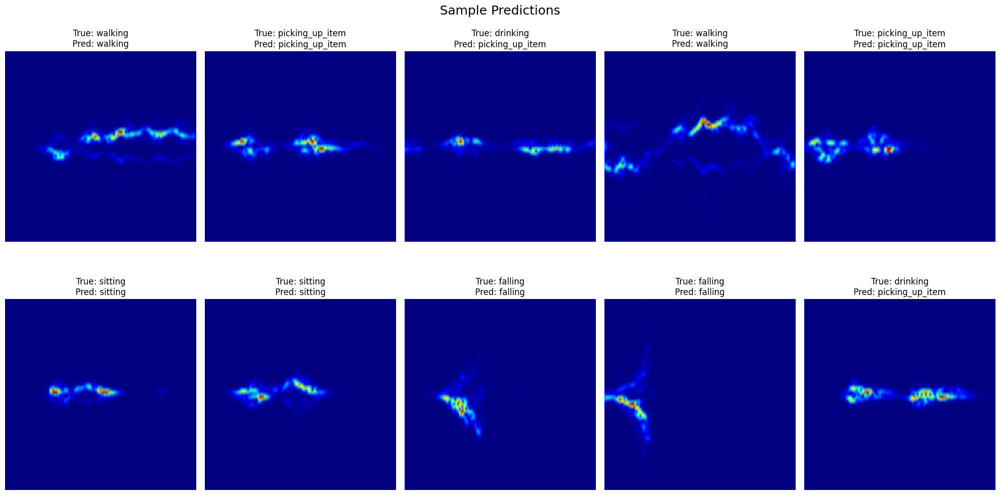

# Goals of implementation
- To monitor indoor human activity with more privacy by using RADAR
- Learn behavior/usual human activity and critical events such as falling

# Sample data

<table border="1" class="dataframe">
  <thead>
    <tr style="text-align: right;">
      <th></th>
      <th>file</th>
      <th>location</th>
      <th>person_id</th>
      <th>activity</th>
      <th>reps</th>
      <th>complex_cnt</th>
      <th>duration</th>
      <th>label</th>
    </tr>
  </thead>
  <tbody>
    <tr>
      <th>4</th>
      <td>5P39A05R01</td>
      <td>1December2017Dataset</td>
      <td>P39</td>
      <td>A05</td>
      <td>R1</td>
      <td>640000</td>
      <td>5.0</td>
      <td>drinking</td>
    </tr>
    <tr>
      <th>5</th>
      <td>6P39A06R01</td>
      <td>1December2017Dataset</td>
      <td>P39</td>
      <td>A06</td>
      <td>R1</td>
      <td>640000</td>
      <td>5.0</td>
      <td>falling</td>
    </tr>
    <tr>
      <th>3</th>
      <td>4P39A04R01</td>
      <td>1December2017Dataset</td>
      <td>P39</td>
      <td>A04</td>
      <td>R1</td>
      <td>640000</td>
      <td>5.0</td>
      <td>picking_up_item</td>
    </tr>
    <tr>
      <th>1</th>
      <td>2P46A02R01</td>
      <td>1December2017Dataset</td>
      <td>P46</td>
      <td>A02</td>
      <td>R1</td>
      <td>640000</td>
      <td>5.0</td>
      <td>sitting</td>
    </tr>
    <tr>
      <th>2</th>
      <td>3P39A03R01</td>
      <td>1December2017Dataset</td>
      <td>P39</td>
      <td>A03</td>
      <td>R1</td>
      <td>640000</td>
      <td>5.0</td>
      <td>standing</td>
    </tr>
    <tr>
      <th>0</th>
      <td>1P45A01R01</td>
      <td>1December2017Dataset</td>
      <td>P45</td>
      <td>A01</td>
      <td>R1</td>
      <td>1280000</td>
      <td>10.0</td>
      <td>walking</td>
    </tr>
  </tbody>
</table>

# Raw radar signal 

# Radar signal after processing
    

    

# Prediction Sample

    Test Accuracy: 88.32%

    

    

                     precision    recall  f1-score   support
    
            walking       0.97      0.94      0.95        62
            sitting       0.88      0.97      0.92        58
           standing       0.93      0.91      0.92        58
    picking_up_item       0.81      0.74      0.77        58
           drinking       0.75      0.79      0.77        58
            falling       1.00      0.97      0.99        40
    
           accuracy                           0.88       334
          macro avg       0.89      0.89      0.89       334
       weighted avg       0.88      0.88      0.88       334
    

